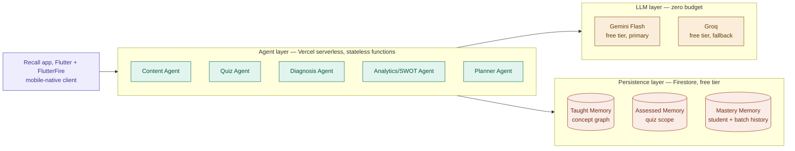
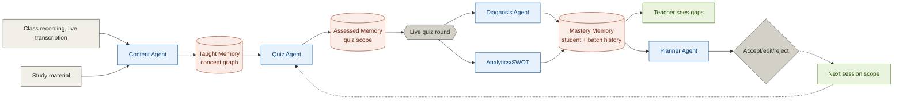

# Recall — Agent-a-thon 2026 Full Context Transfer

Team: Mavericks (Navin + Barathkumar M P + Jasper)
Event: 48 Hours Agent-a-thon, CSE Dept, CEG, Anna University
Theme: Building the Next Generation of Agentic EdTech
Hackathon dates: Sept 19–20, 2026
Registered track: **Persistent Student State**
Product name: **Recall**

---

## 1. The hackathon brief, summarized

- Open to students across all four Anna University campuses: CEG, MIT, SAP, ACT
- First-level PPT submission: Sept 2, 2026. Hackathon itself: Sept 19–20, 2026, 48 hours
- Teams of 1–5, one leader registers everyone, a student can only be on one team
- Six official challenge areas: Multi-Agent Learning Systems, Persistent Student State, Long-Term Cognitive Tracking, Semantic Matchmaking, Agentic Personalized Education, Human-AI Collaborative Learning
- **Disqualifier**: a single-prompt LLM wrapper does not qualify, however clever the prompt. Must show at least one of: state persistence across steps, autonomous tool/API usage, multi-step reasoning/decomposition, or human-in-the-loop callback mechanics
- **Mandatory deliverables**: working agentic slice (must run end-to-end, not a mockup); at least 3 fellow students walking through the flow with captured feedback and a visible iteration cycle; at least one recorded stress test with a fix commit; a design rationale; handoff-ready code
- Judging criteria: innovation, technical agentic implementation, real-user stress testing, user experience, scalability, relevance to theme
- Beyond team prizes: up to 10 individual performers may be selected into the **Foundry Pioneer Cohort**, where build work satisfies an official credit-bearing final-year Capstone requirement
- Contact: Dr. P. Mohamed Fathimal, Assistant Professor, DCSE, CEG — agentathon.cse@gmail.com

## 2. The problem, in plain terms

Classroom AI tools respond to a moment. None of them remember a student across moments. A quiz today has no memory of a quiz three weeks ago. A misconception from week 2 can resurface in week 6 unnoticed, because nothing was tracking it in between. One teacher is expected to hold, in their own head, what forty or sixty students each struggled with, across an entire term. Existing tools run a quiz well; almost none of them carry a result from one session into the next, or tell the teacher what to do about it.

## 3. Core idea

Recall is a mobile app where a teacher runs a live, Kahoot-style quiz built from material they've already prepared. The quiz is the sensor, not the product. Every result gets written into a persistent, concept-level memory, so before the next class the system tells the teacher what still needs review, without being asked. The teacher approves, edits, or rejects every recommendation; the system advises, it never decides on its own.

## 4. Novelty claim

Every other classroom tool we found forgets the second the quiz ends. Recall is built around a different idea: memory lives outside the model, not inside it. No agent holds a growing conversation — each one runs a short call, does its job, and exits, so nothing accumulates and nothing runs out of context. All five agents read from and write to one shared memory instead of keeping their own; what the Content Agent builds, the Quiz Agent uses, what Diagnosis finds, the Planner reads. Nobody re-explains anything to anybody. No existing tool (Kahoot, Socrative, Quizizz, Quizlet Learn Mode, SurveyMars) persists concept-level understanding across sessions and acts on it.

## 5. The three memory levels

| Name | What it holds | Written by | Read by |
|---|---|---|---|
| Taught Memory | Concept graph built from uploaded material + live lecture transcription, versioned per upload | Content Agent | Quiz Agent |
| Assessed Memory | The quiz itself, scoped only to concepts in Taught Memory | Quiz Agent | Diagnosis Agent, Analytics Agent |
| Mastery Memory | Per-student and per-batch performance, recency-weighted so old gaps decay but can resurface | Diagnosis Agent, Analytics Agent | Planner Agent, teacher dashboard |

Core mental model: **the database is the memory, the LLM is a stateless function.** Every agent call fetches a small precomputed slice of state from the DB, formats one prompt, gets one structured response, writes the result back, and exits. No chat history, no context stuffing. This is why memory size in Firestore never becomes context size in the model — growth is a storage cost, not a token cost.

## 6. The five agents

1. **Content Agent** — builds the concept graph from uploaded material (primary signal) and live class transcription (confirmed in-scope for the 48-hour build, parallel signal, not just supplementary). Writes Taught Memory.
2. **Quiz Agent** — generates the live quiz, reading Taught Memory only, so it can never test un-taught material. Writes Assessed Memory.
3. **Diagnosis Agent** — clusters wrong answers by meaning, not exact wording, so different phrasings of the same misconception group together. Writes to Mastery Memory.
4. **Analytics/SWOT Agent** — compiles individual and batch-wide SWOT reports from quiz results. Writes to Mastery Memory.
5. **Planner Agent** — reads Mastery Memory, proposes what to review before the next session. Output is a staged suggestion, not a committed change, until the teacher acts on it.

Open architecture question, never fully resolved: whether Diagnosis and Analytics/SWOT read the live quiz round in parallel (current default in diagrams) or sequentially (`Diagnosis → Analytics`). Current leaning is sequential per one planning doc, but not a locked team decision.

## 7. Known edge cases and mitigations

- **Staleness** — a gap flagged in week 2 might be resolved by week 5 without being re-tested. Mitigated with recency-weighted decay on mastery scores.
- **Concept graph drift** — a teacher revising material mid-semester could leave old sessions pointing at a mismatched graph. Mitigated by versioning the concept graph per upload; old sessions resolve against their own version.
- **Cold start** — first-ever session has no history. Planner Agent has a defined fallback: skip the review step, go straight into new material.
- **Noisy signal** — a student guessing randomly pollutes their mastery vector. Low-confidence data points (e.g. answered in under 2 seconds) can be flagged.
- **Mic capture in a live classroom** — a phone in a pocket isn't reliable, background noise garbles transcription. Mitigated with Bluetooth earbuds (e.g. AirPods) as the mic source; uploaded material still runs in parallel so transcription is never the only input.
- **Numerical/diagram-heavy subjects transcribe poorly** — mitigated by leaning on the teacher's slides/notes for the concept graph in these subjects, and OCR for handwritten assessment answers.
- **Token/context exhaustion from growing memory** — never actually a risk, because no agent ever holds a growing conversation; each queries Firestore fresh per call.

## 8. Zero-budget constraint and how it's handled

- LLM calls: Gemini Flash (free tier, primary), Groq (free tier, fallback)
- Call volume stays low by design: roughly 4–6 total LLM calls per live session (one per agent invocation), not per student or per question
- Persistence costs nothing: Firestore free tier
- Hosting: Vercel free tier for all five backend functions
- No credit card, no billing setup anywhere in the stack
- Open, unconfirmed action item: emailing the organizer (agentathon.cse@gmail.com) to ask if the hackathon has any AI provider credit partnership for participants

## 9. Tech stack

- **Client**: Flutter + FlutterFire — compiles to native code for both Android and iOS from one codebase; FlutterFire binds directly to Firestore's client SDK, giving real-time quiz updates with no separate WebSocket layer. Both teammates are already fluent in Flutter/Dart.
- **Backend runtime**: Node.js + TypeScript on Vercel serverless functions. Each agent is its own function — independent scaling, one failing doesn't affect the rest, sub-second cold starts.
- **LLM layer**: Gemini Flash (primary), Groq (fallback), both free tier.
- **Persistence**: Firestore free tier, holding all three memory levels.

FastAPI/Python was considered and explicitly ruled out — both teammates already have working fluency in Node/TypeScript, and introducing Python would mean learning a second language mid-hackathon for no clear benefit given the agent logic is simple, short, single-purpose LLM calls, not complex orchestration needing a heavyweight Python agent framework.

## 10. Tech stack diagram (mermaid, left to right — confirmed final orientation)

## 11. Memory and agent flow diagram (mermaid, left to right)

Also built as a slide-shaped version using subgraphs grouped into 5 stages (capture → taught memory → live assessment → mastery memory → teacher decision) for fitting a 16:9 slide, though the flat left-to-right chain above is the version actually confirmed working without rendering issues.

## 12. Final justification table (full version)

| Layer | Choice | Justification |
|---|---|---|
| Client | Flutter + FlutterFire | Native mobile app, not a browser demo. Direct Firestore access for low-latency live quizzes. Compiles to native code for both platforms from one codebase; direct Firestore binding gives real-time quiz updates with no extra backend. |
| Backend runtime | Node.js + TypeScript on Vercel | Each agent runs as its own function, so one failing doesn't affect the rest. Starts in under a second, fast enough for several agents firing during one quiz round. |
| Agents | 5 stateless functions | Each agent owns one responsibility: content, quiz, diagnosis, analytics, planning. Easier to test and reason about than a single monolithic prompt. |
| Memory design | 3-level Firestore model | Three explicit stages: what was taught, what was assessed, how students performed. State lives in the database, not in a model's context window. |
| Planning | Human-in-the-loop recommendations | The Planner Agent proposes what to review next; the teacher approves, edits, or dismisses it. The system remains advisory, not autonomous. |
| Long-term tracking | Gaps carried forward in Mastery Memory | Unresolved concepts persist and resurface in later quizzes until resolved, tracking understanding across sessions, not single quizzes. |
| Diagnosis | Semantic clustering of wrong answers | Groups responses by underlying meaning rather than exact wording, so differently phrased misconceptions are still identified correctly. |
| LLM layer | Gemini Flash and Groq, free tier | Zero-cost infrastructure with calls batched per session, keeping cost flat regardless of class size. |

**Closing line**: "Each choice answers a specific requirement, not convenience: specialized agents over one prompt, persistent memory over conversational context, cross-session tracking over one-off quizzes, human-in-the-loop recommendations over full automation."

**Condensed version used for the actual slide** (Tech Specifications, bottom half, 5 rows, tool name folded into justification instead of a separate column):

| Layer | Justification |
|---|---|
| Client | Flutter + FlutterFire — compiles to native code for both platforms from one codebase. Direct Firestore binding gives real-time quiz updates with no extra backend. |
| Backend | Node.js + TypeScript on Vercel — each agent runs as its own function, so one failing doesn't affect the rest. |
| Memory | Firestore, 3-level model — Taught → Assessed → Mastery. Gaps resurface in later quizzes until resolved. State lives in the database, never in a model's context. |
| Planning | Planner Agent — proposes what to review next; the teacher approves, edits, or dismisses it. Advisory, not autonomous. |
| LLM layer | Gemini Flash + Groq, free tier — zero-cost infrastructure, calls batched per session, so cost stays flat as class size grows. |

## 13. Market Fit — TAM / SAM / SOM

- **TAM**: $2.4B global online quiz/assessment platform market in 2026, projected to reach $6.6B by 2033 at 15.9% CAGR (Verified Market Reports)
- **SAM**: 500+ Anna University affiliated engineering colleges across Tamil Nadu (494 affiliated + 16 constituent colleges per most recent figures; other sources cite up to ~593)
- **SOM**: The 4 Anna University campuses this hackathon spans (CEG, MIT, SAP, ACT), starting with individual lecturers running classes of 40–80 students

**Research backing** (kept as real cited figures, explained in plain language):
- Effect size 0.4–0.7 on student achievement, across ages 5 through university — in education research, above 0.4 is considered a strong, reliable effect
- Ranked 3rd of 138 factors influencing learning outcomes, effect size 0.9, from Hattie's meta-analysis, the largest synthesis of education research ever conducted
- 23 studies reviewed, consistent positive effect, US Institute of Education Sciences — a pattern confirmed across two dozen independent studies, not one result

**Adoption realism** (left column, bottom half of the Market Fit slide):
- 40–80 students per class, the typical Anna University lecture size, is past the point where a teacher can track individual understanding without help
- Every campus already runs quizzes informally; Recall upgrades an existing habit rather than requiring a new one
- ₹0 to adopt — no procurement cycle, no paid tier, no IT approval; one lecturer can start tomorrow

Visual: a three-tier funnel (TAM outer, SAM middle, SOM inner), title **"Market Sizing: TAM, SAM, SOM"**, built once as an inline SVG diagram and also as an image-generation prompt (flat vector, downward triangle, navy/teal/coral tiers, no gradients or 3D effects, for pasting into an image generator directly).

## 14. Challenges & Risks table (final compressed version used on the slide)

| Challenges and Risks | How we wish to Overcome |
|---|---|
| Clean mic capture in a noisy classroom | Bluetooth earbuds as the mic source; uploaded material also feeds the concept graph, so audio is never the only input |
| Numerical or diagram-heavy subjects transcribe poorly | Teacher's slides carry the concept graph for these; OCR handles handwritten answers |
| Free-tier LLM rate limits during a live quiz | Calls batched per agent, not per student; Groq as automatic fallback |
| Growing memory could exhaust tokens if stuffed into a prompt | It never is. Agents query Firestore fresh each call, so memory size never becomes context size |

## 15. Beyond the live quiz — additional touchpoints (dense paragraph form, for Proposed Solution or a supporting slide)

Beyond the live quiz, Recall extends into three additional touchpoints, each reading from the same Taught Memory the Content Agent already maintains, so nothing new needs to be re-taught to the system. Mid-class, the teacher can trigger an on-demand question set at any point, generated from everything covered up to that exact moment in the session, giving the teacher a live probe they can ask aloud whenever the lecture reaches a natural pause. After class ends, students automatically receive a short set of notes summarizing that day's material, and can optionally take a self-paced quiz on it, explicitly excluded from any evaluation or grading, since making revision optional and low-stakes avoids adding pressure for students who'd otherwise feel obligated to perform. At the end of each week, students get a consolidated review sheet covering everything taught that week, paired with a short recap quiz, again ungraded and entirely opt-in. For classrooms that still run assessments on paper, the same quiz can be exported as a downloadable, printable PDF; once completed by hand, the teacher photographs or scans the answer sheets and uploads them back into Recall, where OCR reads the handwritten responses and feeds them into the same Diagnosis and Analytics agents used for the digital flow, so a paper-based classroom gets identical concept-level tracking and mastery updates without ever touching a screen during the actual test.

## 16. Slide-by-slide content, as finalized for the official template

**S1 — Cover**
Team Name: MAVERICKS · Chosen Track: Persistent Student State · Lead Name: Navin · Team Lead Contact: 9363129869 · Mail: vnavin7714@gmail.com

**S2 — Team Details**
Columns: **Name | Register No. | Year | Department** (confirmed final column set, supersedes an earlier draft that used Name/Role/Contact/Focus Area and another that used Name/Department & Year/College/Contact). Register numbers not yet filled in — user to complete.
- Navin — Robotics & Automation, MIT Anna University
- Barathkumar M P — CSE, CEG Anna University
- Jasper

**S3 — Problem Statement** (final version)
> Ask a student a question and today's AI answers instantly. Ask it what that same student got wrong last month, and it has nothing.
- A quiz today has no record of the quiz from three weeks ago. Every session starts blank.
- A student can misunderstand something in week 2 and still not have it fixed by week 6, because no one was checking.
- A teacher with sixty students is expected to remember all of this on their own, for every one of them, all term.
- Most classroom tools run a quiz well. Almost none of them carry a result from one class into the next, or tell the teacher what to do about it.
- So the question isn't how to make the quiz smarter. It's what happens after the quiz ends.

**S4 — Proposed Solution** (final version)
Solution Overview: *A mobile-native agentic system for classrooms. A teacher runs a live, Kahoot-style quiz from uploaded material; five agents turn results into a memory of what was taught, assessed, and mastered, so unresolved gaps resurface automatically.*
Key benefits:
- Quizzes can only test what was actually taught that day, generated straight from the teacher's own material.
- Wrong answers are grouped by the misconception behind them, not by which option got picked.
- A gap that isn't fixed keeps resurfacing until it is.
- The teacher approves, edits, or ignores every recommendation. The system advises. It doesn't decide.
Callout number: **3-level memory. 1 system.** (subtext: *Taught → Assessed → Mastery, all in one persistent record.*)

**S5 — High Level Design**
Header line (few words, right of title): "Five agents work independently, all reading and writing to one memory that carries across every session." Diagram: the memory/agent flow diagram (section 11 above), left to right, already built and rendered by the user in a separate tool (DroneID/Mermaid) with Level 1/2/3 labeling — flagged as needing a naming-consistency fix to match Taught/Assessed/Mastery, and a "Master Memory" typo (should read Mastery Memory) in the Planner Agent box, not yet confirmed fixed.

**S6 — Tech Specifications**
Top half: tech stack diagram (section 10), left to right. Bottom half: condensed 5-row justification table (section 12, condensed version) plus space reserved on the right for logos.

**S7 — Innovation & Uniqueness** (final version)
> Every other classroom tool we found forgets the second the quiz ends. Recall is built around the opposite bet: the quiz is the least interesting part.
- Most tools measure one hour well. None of them ask what happens to that hour a week later. Recall does. A misconception from three weeks ago can still show up on today's quiz if it was never actually fixed.
- Wrong answers don't get scored by which box was ticked. They get grouped by the actual misunderstanding behind them, so two students who mess up differently but for the same reason still count as one gap, not two.
- No agent holds a growing conversation. Each one runs a short call, does its job, and exits, so nothing ever accumulates and nothing runs out of context.
- All five agents read from and write to one shared memory instead of keeping their own. What the Content Agent builds, the Quiz Agent uses. What Diagnosis finds, the Planner reads. Nobody re-explains anything to anybody.
- Built as a mobile app both teachers and students actually open during class, not a dashboard someone checks later if they remember to.

**S8 — Market Fit**
Left column top: research backing (section 13). Left column bottom: adoption realism (section 13). Right side: TAM/SAM/SOM funnel image, titled "Market Sizing: TAM, SAM, SOM".

**S9 — Challenges & Risks**
Final compressed table, section 14.

**S10 — Future Scope** (final version, kept close to the core persistence objective, 4 items)
- Prerequisite-aware planning — trace a gap back to the earlier concept that actually caused it, so the Planner Agent targets the root misunderstanding, not just the symptom on the quiz.
- Peer-teaching matcher — the mastery vectors already being computed are enough to pair a student who's strong on a concept with one who's weak on it, closing gaps without the teacher intervening every time.
- Cross-subject memory — the same Taught, Assessed, and Mastery model extended across every subject a student takes, so a gap in one course's prerequisite concept is visible even from a different class.
- Selection into the Foundry Pioneer Cohort — continuing this exact build as a credit-bearing capstone project under CEG alum mentorship.

## 17. A worked pptx build (separate track, may be superseded by the live Google Slides doc)

Earlier in this process, the official pptx template (10 fixed slides: Cover, Team Details, Problem Statement, Proposed Solution, High Level Design, Tech Specifications, Innovation & Uniqueness, Market Fit, Challenges & Risks, Future Scope) was filled programmatically via python-pptx as a demonstration/starting point, saved as `recall_filled.pptx`. This surfaced two real template quirks worth knowing regardless of which tool finishes the deck:
- **Slide 2's "table"** is actually a flat picture/image of a grid (blipFill), not real editable table cells — text must be manually positioned over it at the correct row/column coordinates, not auto-flowed.
- **Slide 5 (High Level Design)** ships with a pre-existing placeholder diagram image already on the slide (a generic "Specification and Execution Layer / Data Layer / Analytics Layer" diagram with a "boardmix" watermark) that must be deleted before placing a real architecture diagram, or the two will visually overlap.
The user has since been building the actual deck directly in Google Slides (doc title "Mavericks (Agent-A-Thon)"), which is the live, current source of truth — this pptx file is a secondary reference only.

## 18. Team

- Navin — Team Lead. Full-stack engineer and indie maker, based in South India. GitHub: Hexraei. Studying Robotics and Automation at MIT Anna University (MIT Campus, Chennai), 5th semester, Regulation 2023, CGPA 8.67/10.0. Experience with Next.js, C#/.NET 8, SignalR, WPF, TypeScript, Python, AI/agentic systems.
- Barathkumar M P — Team Member, CSE, CEG Anna University.

## 19. Still open / unresolved as of this transfer

1. Diagnosis → Analytics: confirmed as parallel in the main diagrams, but one planning doc leans sequential — not a locked team decision.
2. Register numbers for the Team Details slide — not yet filled in.
3. Slide 5's rendered diagram (built by the user in a separate tool) needs a naming-consistency pass: unify on Taught/Assessed/Mastery Memory throughout, fix "Master Memory" → "Mastery Memory" typo in the Planner Agent box.
4. Auth approach for the actual 48-hour build: full login vs. a simple join-code (Kahoot-style PIN) — not decided, simple code recommended for time.
5. Agent trigger model: direct call from Flutter app vs. Firestore-write-triggered — direct call recommended for simplicity within the time limit, not formally locked.
6. TAM/SAM/SOM image: either use the rendered inline SVG funnel directly, or the separate image-generation prompt (section 13) if a differently styled graphic is wanted.
